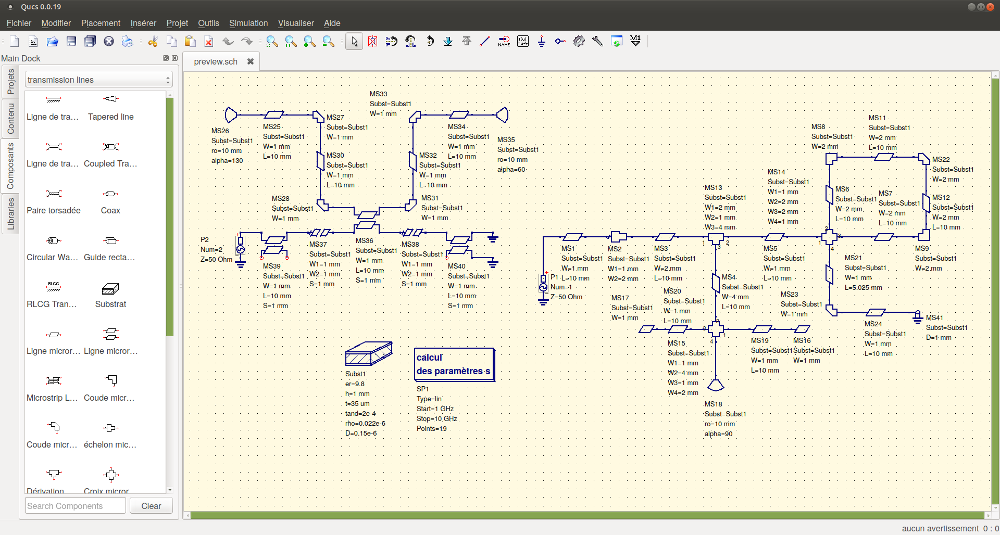
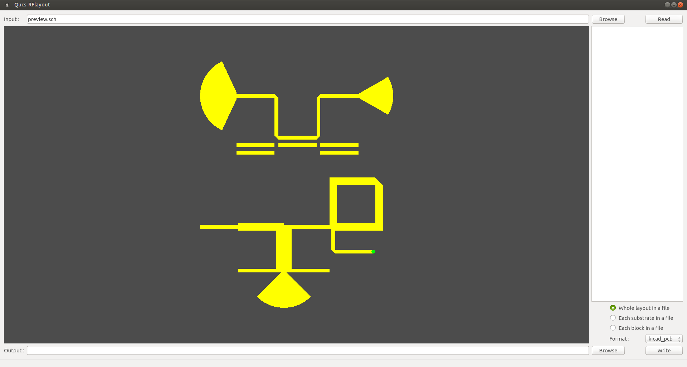
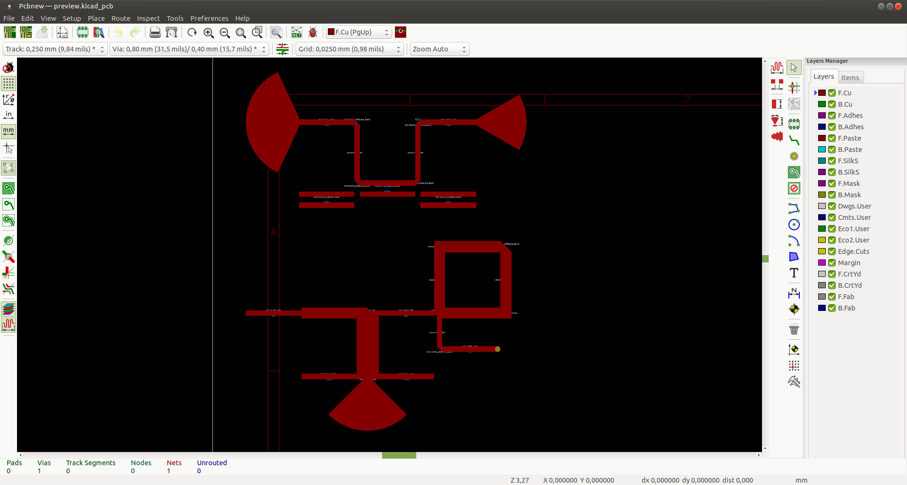
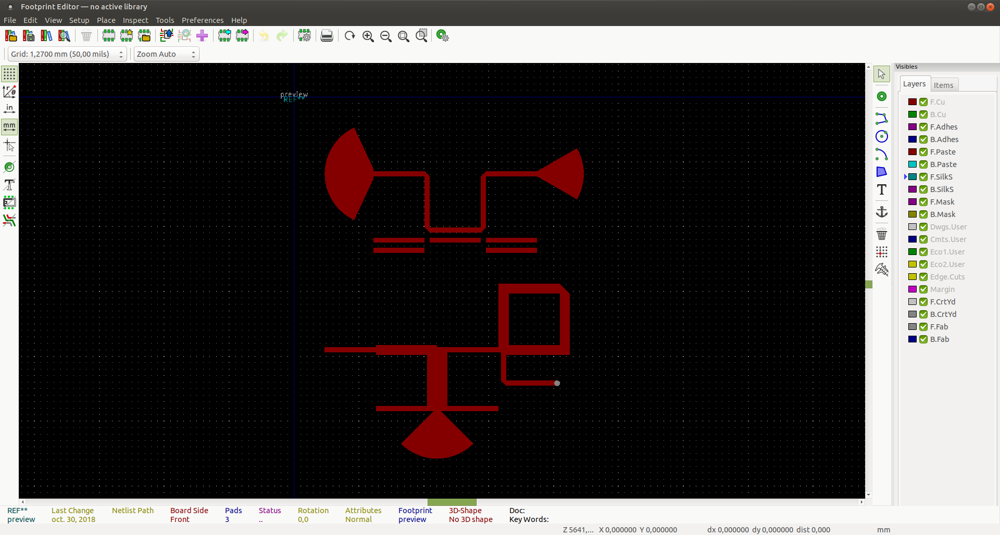
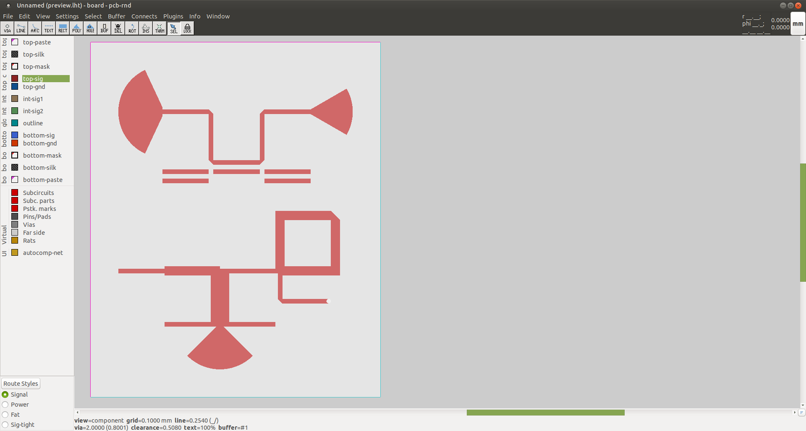
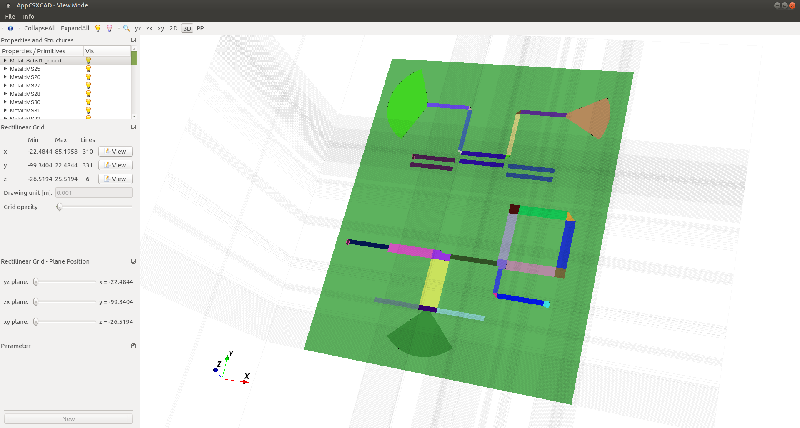
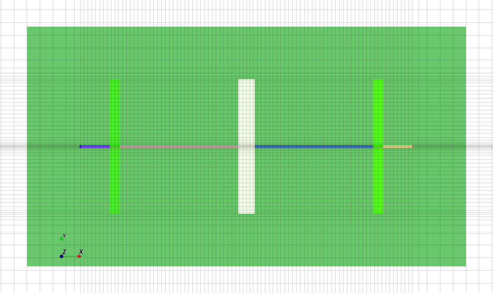
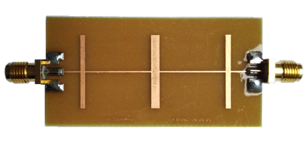
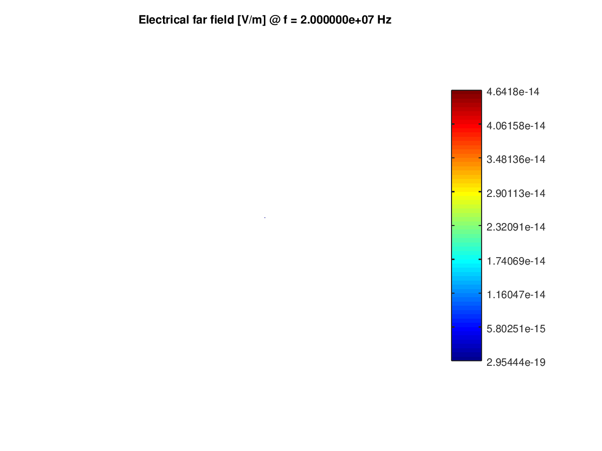
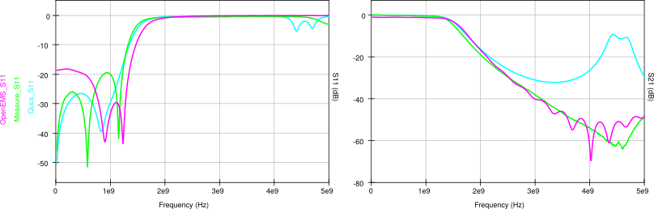

[](https://liberapay.com/thomaslepoix/donate)
[](https://discord.gg/P82fEmE)
[](LICENSE)
[](https://github.com/thomaslepoix/Qucs-RFlayout/releases/latest)
[](https://builtwithnix.org/)

[](https://github.com/thomaslepoix/Qucs-RFlayout/security/code-scanning?query=is%3Aopen+branch%3Amaster+tool%3ACodeQL)
[](https://sonarcloud.io/dashboard?id=thomaslepoix_Qucs-RFlayout)

[](https://software.opensuse.org/download.html?project=home:thomaslepoix:open-rflab&package=qucsrflayout)
[](https://github.com/thomaslepoix/Qucs-RFlayout/releases)

# Qucs-RFlayout

A tool to produce layouts from Qucs RF schematic (microstrip only for now)

`qucs-schematic.sch` -> `kicad-layout.kicad_pcb` [OK]

&nbsp;&nbsp;&nbsp;&nbsp;&nbsp;&nbsp;&nbsp;&nbsp;&nbsp;&nbsp;&nbsp;&nbsp;&nbsp;&nbsp;&nbsp;&nbsp;&nbsp;&nbsp;&nbsp;&nbsp;&nbsp;&nbsp;&nbsp;&nbsp;&nbsp;&nbsp;&nbsp;&nbsp;&nbsp;&nbsp;&nbsp;&nbsp;&nbsp;&nbsp;&nbsp;&nbsp;&nbsp;&nbsp;&nbsp;
-> `kicad-module.kicad_mod` [OK]

&nbsp;&nbsp;&nbsp;&nbsp;&nbsp;&nbsp;&nbsp;&nbsp;&nbsp;&nbsp;&nbsp;&nbsp;&nbsp;&nbsp;&nbsp;&nbsp;&nbsp;&nbsp;&nbsp;&nbsp;&nbsp;&nbsp;&nbsp;&nbsp;&nbsp;&nbsp;&nbsp;&nbsp;&nbsp;&nbsp;&nbsp;&nbsp;&nbsp;&nbsp;&nbsp;&nbsp;&nbsp;&nbsp;&nbsp;
-> `pcb-rnd-layout.lht` [OK]

&nbsp;&nbsp;&nbsp;&nbsp;&nbsp;&nbsp;&nbsp;&nbsp;&nbsp;&nbsp;&nbsp;&nbsp;&nbsp;&nbsp;&nbsp;&nbsp;&nbsp;&nbsp;&nbsp;&nbsp;&nbsp;&nbsp;&nbsp;&nbsp;&nbsp;&nbsp;&nbsp;&nbsp;&nbsp;&nbsp;&nbsp;&nbsp;&nbsp;&nbsp;&nbsp;&nbsp;&nbsp;&nbsp;&nbsp;
-> `openEMS-script.m` [Beta]

&nbsp;&nbsp;&nbsp;&nbsp;&nbsp;&nbsp;&nbsp;&nbsp;&nbsp;&nbsp;&nbsp;&nbsp;&nbsp;&nbsp;&nbsp;&nbsp;&nbsp;&nbsp;&nbsp;&nbsp;&nbsp;&nbsp;&nbsp;&nbsp;&nbsp;&nbsp;&nbsp;&nbsp;&nbsp;&nbsp;&nbsp;&nbsp;&nbsp;&nbsp;&nbsp;&nbsp;&nbsp;&nbsp;&nbsp;
-> `gmsh.geo` [ASAP]

<br>

French documentation [here](https://github.com/thomaslepoix/ESTEI/blob/master/M2_CPP_Qucs-RFlayout/Qucs-RFlayout.pdf)

This software is a part of the [Open-RFlab](https://github.com/Open-RFlab/Open-RFlab) project and relies on the [octave-openems-hll](https://github.com/Open-RFlab/octave-openems-hll) library, if you are interrested in contributing or involved in an other `somewhat -> openems` converter please take a look.

<br>

## Screenshots

### Qucs : schematic.sch


### Qucs-RFlayout : preview


### Pcbnew : layout.kicad_pcb


### Pcbnew : module.kicad_mod


### Pcb-rnd : layout.lht


### OpenEMS : simulation.m


- Better example : A low pass filter designed, produced and measured by [F4HDG](https://wiki.rfporn.org/doku.php/wiki:projects:filtres:lpf_23cm_microstrip). Thanks to him!


 

 



- Generated scripts outputs :
    - Touchstone file (`.sxp`)
    - S parameters (Smith chart and orthogonal)
    - Feed point impedance
    - Feed point VSWR
    - Phase response (wrapped and unwrapped)
    - Phase delay and group delay
    - Azimuth & elevation far field radiation pattern (polar and orthogonal, normalized and in dBi)
    - 3D far field radiation pattern for multiple frequencies (animated `.gif`)
    - Electric & magnetic fields, current and current density in time domain (visible with Paraview)

- [Here](doc/tutorials/openems.md) is a tutorial.

<br>

## Installation

### Dependencies

- [Qucs](https://github.com/Qucs/qucs) or [Qucs-S](https://github.com/ra3xdh/qucs_s) is needed (even if you want to convert QucsStudio files), be sure it is installed and accessible from your `PATH` variable.
- OpenEMS scripts dependencies :
  - [OpenEMS](https://openems.de/index.php/OpenEMS#Installation) (`octave-openems` package available on Debian based distros, `octave-openEMS` on openSUSE)
  - [ImageMagick](https://imagemagick.org/script/download.php) (packages available on most distros)

### Package installation

- For Debian based distributions, a repository is available [here](https://software.opensuse.org/download.html?project=home:thomaslepoix:open-rflab&package=qucsrflayout).

- For RPM based distributions and Windows, you can download packages [here](https://github.com/thomaslepoix/Qucs-RFlayout/releases).

### Installation from sources

- Nix way (non-NixOS) :

```sh
nix profile install --impure 'github:thomaslepoix/Qucs-RFlayout#qucsrflayoutNixGL'
```

- Debian way : Take a look [on the debian branch](https://github.com/thomaslepoix/Qucs-RFlayout/tree/debian).

- Classic way :

The build-time dependencies are the following on Debian, check equivalents on your own (reports are welcome) for non Debian-based distros :

`qt6-base-dev`, `libqt6opengl6-dev`, `texlive-xetex`, `fonts-lato`

```sh
Qucs-RFlayout $

    cmake -S. -Bbuild -DCMAKE_BUILD_TYPE=Release
    cmake --build build
    sudo cmake --build build --target install
```

Supported build options (among regular CMake options):
| option | value | default | comment
|-|-|-|-|
| `CMAKE_BUILD_TYPE` | `Debug`, `Release`, `Coverage` ... | `Release` | |
| `CMAKE_CXX_COMPILER` | `g++`, `clang++` ... | |
| `QRFL_MINIMAL` | `ON`, `OFF` | `OFF` | Disable GUI and Qt dependency |

<br>

## Usage

```sh
qucsrflayout -i qucs-schematic.sch -o output-directory -f .output-format
```

<br>

## Limitations

- Microstrip only for now, coplanar waveguide ASAP.
- Any other component cannot be converted into a geometric shape of metal by this tool.
- Use one wire to connect only two component ports, use appropriate components to make tees or crosses.
- QucsStudio schematics are supported (2.x versions only) but it is closed source and there are some incompatibilities, so please prefer using Qucs. If you really need to work with QucsStudio 3.x, take a look at [this converter](https://github.com/Paulo-D2000/QucsStudioConverter).

<br>

Work in progress... thomas.lepoix@protonmail.ch
