# OpenEMS exporter

- [Basic usage](#Basic_usage)
  - [First conversion](#First_conversion)
  - [Control flags](#Control_flags)
  - [Mesh check](#Mesh_check)
  - [Run the simulation](#Run_the_simulation)
  - [Postprocessing frequencies](#Postprocessing_frequencies)
  - [NF2FF basics](#NF2FF_basics)
  - [NF2FF center](#NF2FF_center)
  - [NF2FF 3D](#NF2FF_3D)
  - [Use results in Qucs](#Use_results_in_Qucs)
  - [Visualize dumps with Paraview](#Visualize_dumps_with_Paraview) (TODO)
- [Tips & tricks](#Tips_&_tricks)
  - [Convert a schematic portion only](#Convert_a_schematic_portion_only) (TODO)
  - [Deal with too close mesh lines : Stub filter example](#Deal_with_too_close_mesh_lines_:_Stub_filter_example)
  - [Move & resize ports : Center fed patch antenna example](#Move_&_resize_ports_:_Center_fed_patch_antenna_example) (TODO)
  - [Draw special geometries with Qucs components : Loop patch antenna example](#Draw_special_geometries_with_Qucs_components_:_Loop_patch_antenna_example) (TODO)

## Basic usage <a name="Basic_usage"></a>

This example is based on a microstrip low pass filter designed, produced and measured by [F4HDG](https://wiki.rfporn.org/doku.php/wiki:projects:filtres:lpf_23cm_microstrip).


### First conversion <a name="First_conversion"></a>

Let's run a first conversion :

```sh
qucsrflayout -i lpf.sch -f .m
```

If you want to reproduce this example and got the following errors, read [this chapter](#Convert_a_schematic_portion_only) :

```sh
ERROR : No substrate used in a block
ERROR : No substrate used in a block
ERROR : No substrate used in a block
ERROR : No substrate used in a block
```

Then take a look to the script's help :

```sh
octave lpf.m -h
```

### Control flags <a name="Control_flags"></a>

The control flags let you chose what to execute in the script. There is three principal parts :

- Preprocessing : Structure and mesh construction.
- Processing : FDTD simulation.
- Postprocessing : Far field computation & human readable results plotting.

It is totally possible to run parts one by one, running the script for each one (may be useful for very long simulations). Most useful flags are :

- `--only-preprocess` : To check the circuit and its mesh before starting a simulation.
- `--only-postprocess` : To rerun postprocessing with different options or simply to vizualize results.
- `--no-gui` : Not to pop the AppCSXCAD window showing the circuit.

### Mesh check <a name="Mesh_check"></a>

The first step after a conversion is to check the produced mesh, as default mesh resolutions are arbitraries.

There are three resolutions :

- `highres` : Used for non-orthogolal components such as `MMBEND` and `MRSTUB` that need a tighter mesh.
- `metalres` : Used for other components.
- `substres` : Used everywhere else.

All of these resolutions are exprimed as wavelength fractions. You can set the divisors.

---

```sh
octave lpf.m --only-preprocess
```


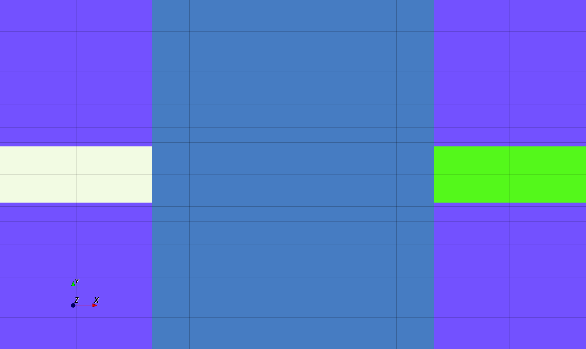

The mesh looks good but a little too large. To obtain better results we can reduce it by growing the divisor, trying different values. You can either modify it in the script :

```matlab
high_div = 200;        % Depend on your simulation, you may want to tweak this value
metal_div = 60;        % Depend on your simulation, you may want to tweak this value
substrate_div = 30;    % Depend on your simulation, you may want to tweak this value
```

Or rerunning qucsrflayout :

```sh
qucsrflayout -i lpf.sch -f .m --oems-metalres-div 100
octave lpf.m --only-postprocess
```

100 looks better than 60.

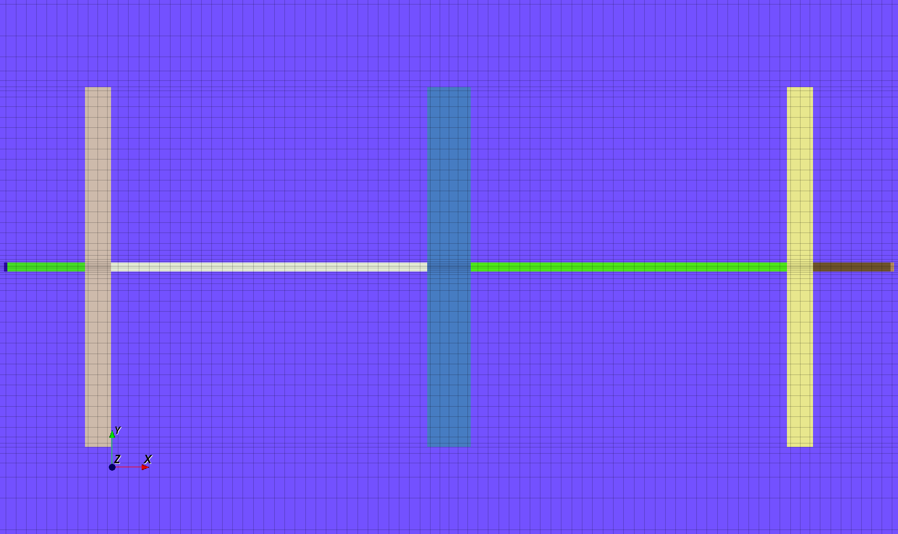
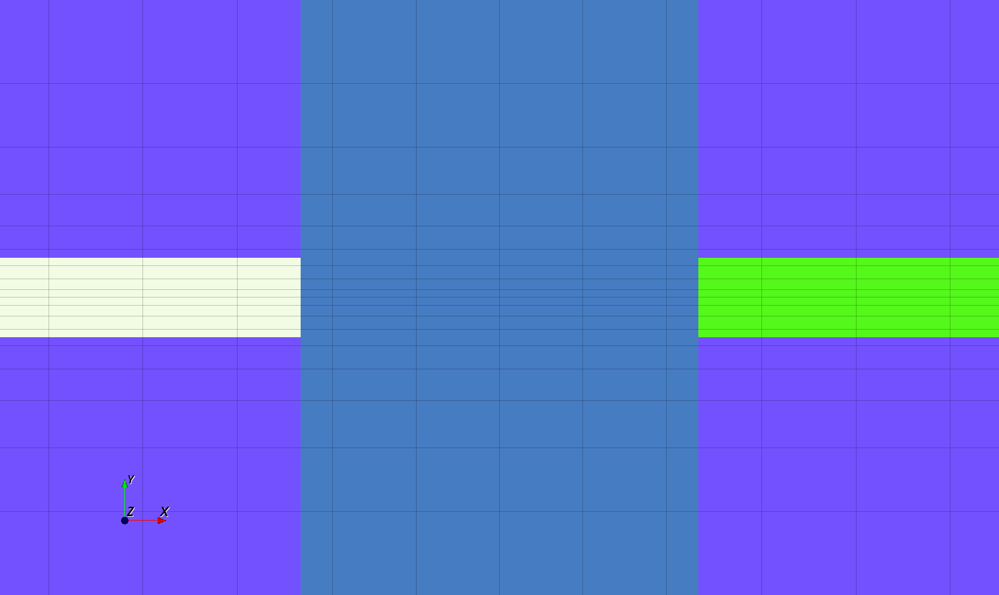

To deal with more complicated circuits and difficult meshs, take a look [to this chapter](#Deal_with_too_close_mesh_lines_:_Stub_filter_example).

### Run the simulation <a name="Run_the_simulation"></a>

Once the mesh is good, you can run processing and postprocessing steps.

```sh
octave lpf.m
```

You can also chose the ports you want to excite during the simulation. By default the first port is the only one activated. Keep in mind that two things :

- In the case of a two-ports circuit like this filter, if only the port 1 is activated, only S11 and S21 will be calculated.
- Activating multiple ports will cause the results to be totally wrong in most of the case. Be careful.

---

After some minutes, result windows will pop up and also be saved in `lpf_results/` :

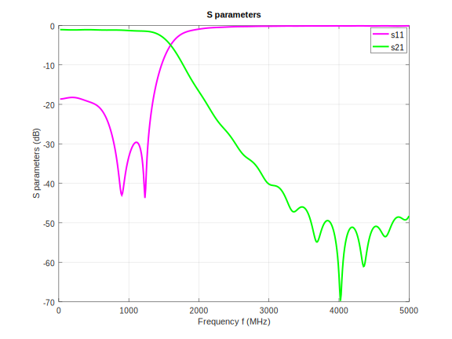
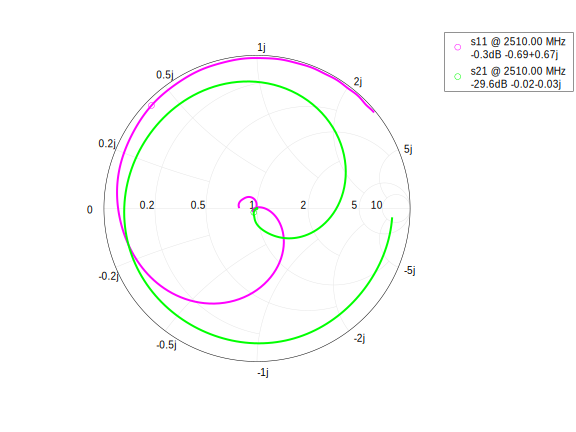
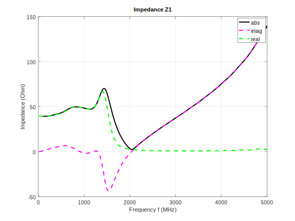
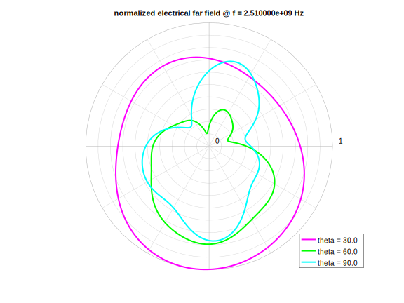
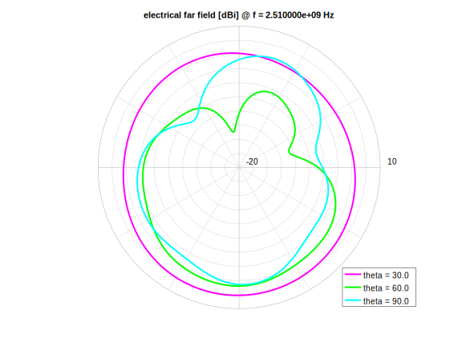
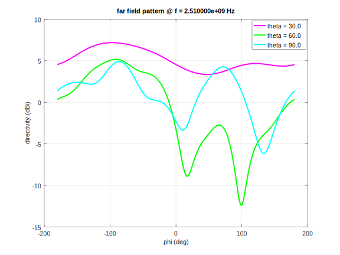
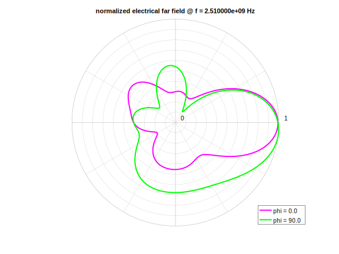
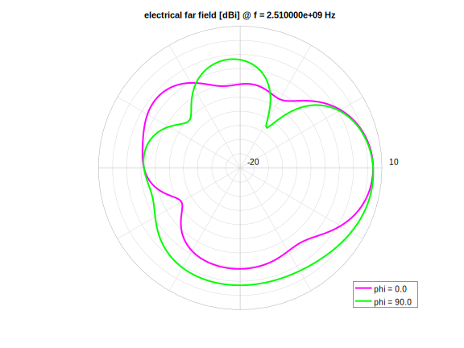
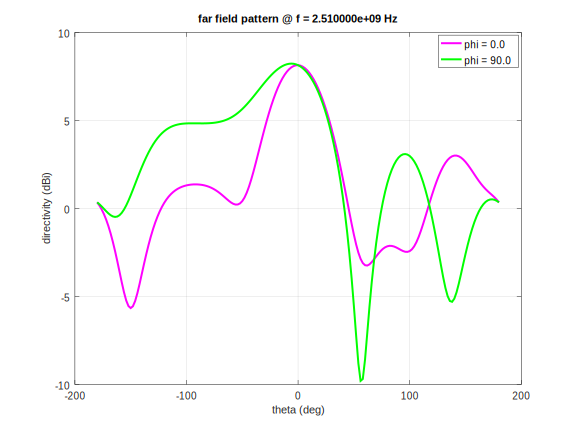

### Postprocessing frequencies <a name="Postprocessing_frequencies"></a>

You may want to configure the frequencies to place markers and compute far field radiations. This filter is designed to cut off at 1,8GHz, let's watch this frequency :

```sh
octave lpf.m --only-postprocess --f 1.8e9
```

You can also watch extremums of a S parameter `--f-min s11` or watch the frequency at which a S parameter match (approach) a value in dB `--f-equal s21 -10`. All these arguments are cumulable.

### NF2FF basics <a name="NF2FF_basics"></a>

As sometimes the far field computation is longer than the simulation itself, you can disable it `--no-nf2ff`.

---

Each time you rerun far field processing after changed some postprocessing options, you will see this message from the `CalcNF2FF` OpenEMS function :

```
CalcNF2FF: Reading nf2ff data only...
error: data mismatch between read and requested data --> recalculate nf2ff --> Set Mode to 1 
```

It is because the already present NF2FF datas from previous computation does not correspond with the new options. So you have to force a new far field computation `--nf2ff-force`.

---

To understand the results, keep in mind this schematic and that the angles grow counterclockwise :


### NF2FF center <a name="NF2FF_center"></a>

OpenEMS documentation say that the far field center should be placed at the center of the radiating element. By default it is placed at the simulation box center. This placement is good in a CEM context or while designing a device like a filter. But if you design an antenna, be careful with it.

You can use the center of any component as the far field center by rerunning qucsrflayout. For example if you want to use the microstrip line `MS2` of this filter as NF2FF center, just do :

Warning : Do not forget other flags you used before, like mesh and port flags.

```sh
qucsrflayout -i lpf.sch -f .m --oems-nf2ff-center MS2
octave lpf.m --only-postprocess
```

To place the NF2FF center elsewhere, you can manually edit the script :

```matlab
% NF2FF center should be placed at the center of the radiating element.
%nf2ff.center = [(max(mesh.x)-min(mesh.x))/2, (max(mesh.y)-min(mesh.y))/2, 0];
nf2ff.center = MS2.center;
```

### NF2FF 3D <a name="NF2FF_3D"></a>

You can enable 3D far field representation with `--nf2ff-3d`. It will represent it for each watched frequency.

You can also create an animated representation (`.gif`) of the far field evoluting through the frequency range with a unique color scale a unique size scale. You just have to specify how many frames you want between the start frequency and the end frequency. The delay between each frame is 30ms but you can change it, for example reduce it if you have many frames :

```sh
octave lpf.m --only-postprocess --nf2ff-3d --nf2ff-frames 50 --nf2ff-delay 10
```


---

You can also modify the angles step (in degree), reduce it to produce better diagrams or grow it to speed the nf2ff computation. 

```sh
octave lpf.m --only-postprocess --nf2ff-force --nf2ff-3d --nf2ff-anglestep 1
```
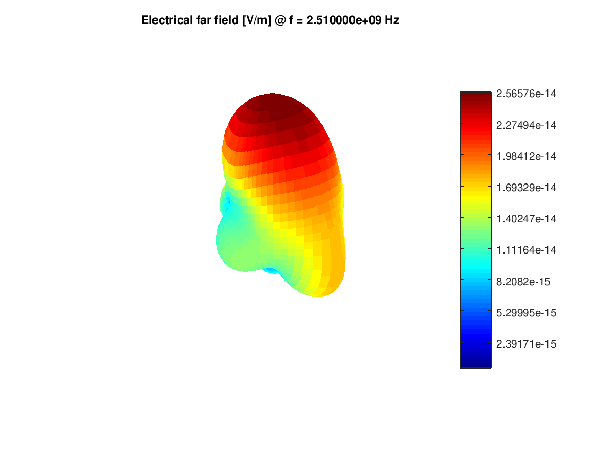


### Use results in Qucs <a name="Use_results_in_Qucs"></a>

You can use the produced Touchstone file to import and compare results in Qucs, as usual.


### Visualize dumps with Paraview <a name="Visualize_dumps_with_Paraview"></a>

## Tips & tricks <a name="Tips_&_tricks"></a>

### Convert a schematic portion only

### Deal with too close mesh lines : Stub filter example <a name="Deal_with_too_close_mesh_lines_:_Stub_filter_example"></a>

For a better understanding of how each component is meshed by Qucs-RFlayout, you can read the documentation.  TODO

---

Sometimes, to get a proper mesh is more complicated than just changing the mesh resolution. Let's take this stub filter example :


```sh
qucsrflayout -i stub.sch -f .m
octave stub.m --only-preprocess
```

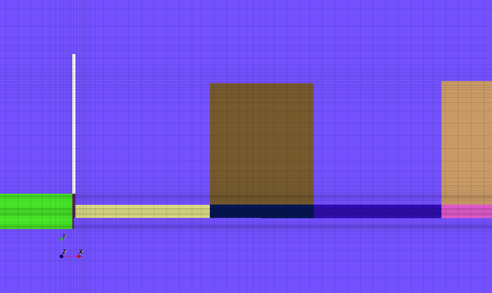

The mesh produce some `warning: division by zero` and looks totally wrong. What happens?

First, you must display only particular mesh lines :

```sh
octave stub.m --only-preprocess --no-smoothmesh
```

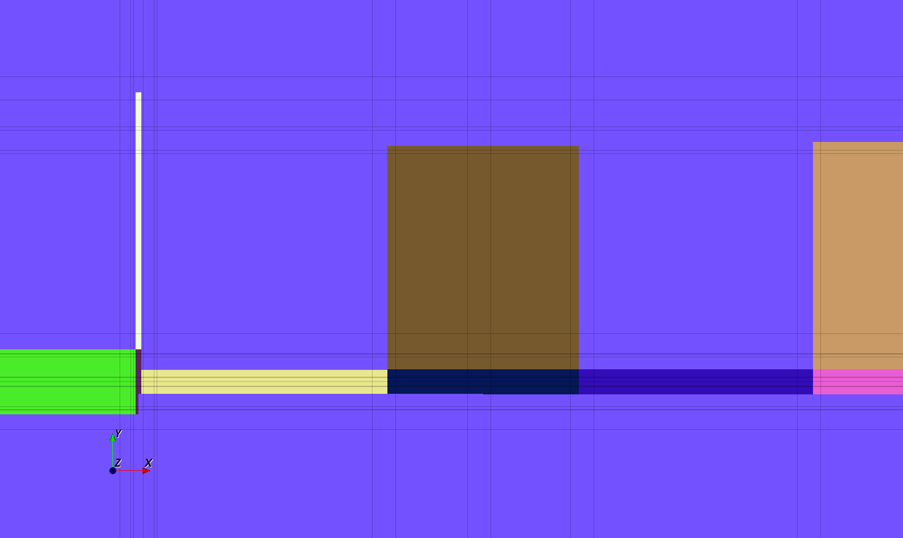

Different problems here :

- Too large mesh resolution. No difficulty, just try some different divisors. But be careful, to solve the second problem, you will have to edit the script so do it manually, not to overwrite the script with `qucsrflayout --oems-*res-div`. `100` looks good to understand from which edge each line comes.
- Some really close parallel edges produce really close mesh lines that conflict during the smoothmesh generation. To solve this problem, you will have to manually remove some mesh lines and eventually add some. It is painful but not so much and not so much error prone.

---

- The central stub `MS9` is slightly longer than it two adjacent stubs `MS7` and `MS8`. To fix the extremity horizontal lines problem, it looks safer to remove `MS9` lines :
  ```matlab
  mesh.y = [mesh.y, ...
  	(-33.2952 + 2*metal_res/3), (-33.2952 - metal_res/3), ... % MS7 : MLIN
  	(-33.2952 + 2*metal_res/3), (-33.2952 - metal_res/3), ... % MS8 : MLIN
  %	(-33.1334 + 2*metal_res/3), (-33.1334 - metal_res/3), ... % MS9 : MLIN
  	];
  ```

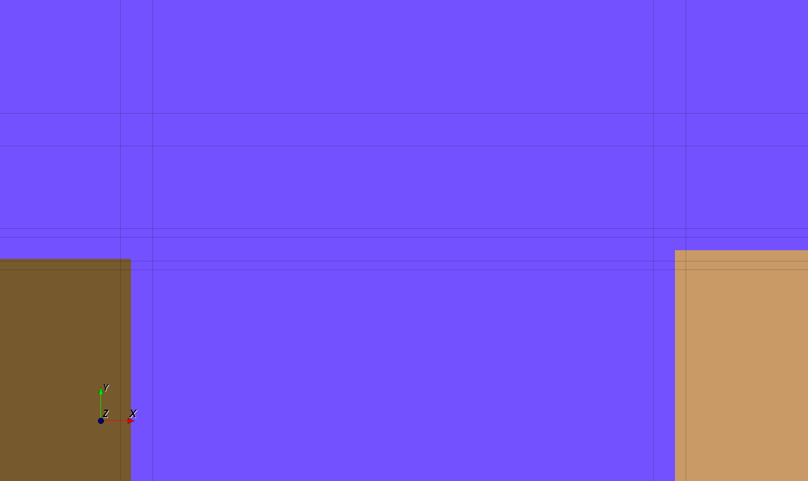


- The lines `MS10` and `MS11` are slightly larger than `MS6` and `MS5`, you can see it by the small step on the `MS13` and `MS15` tees. Let's remove `MS10` and `MS11` horizontal lines and also the bottom line of the `MS14` tee and the bottomer lines of the `MS13` and `MS15` tees.

  ```matlab
  mesh.y = [mesh.y, ...
  %	(-43.9514 - 2*metal_res/3), (-43.9514 + metal_res/3), ... % MS10 : MLIN
  %	(-42.8674 + 2*metal_res/3), (-42.8674 - metal_res/3), ... % MS10 : MLIN
  %	(-43.9514 - 2*metal_res/3), (-43.9514 + metal_res/3), ... % MS11 : MLIN
  %	(-42.8674 + 2*metal_res/3), (-42.8674 - metal_res/3), ... % MS11 : MLIN
  	(-43.9276 - 2*metal_res/3), (-43.9276 + metal_res/3), ... % MS13 : MTEE
  %	(-43.9514 - 2*metal_res/3), (-43.9514 + metal_res/3), ... % MS13 : MTEE
  %	(-43.9514 - 2*metal_res/3), (-43.9514 + metal_res/3), ... % MS14 : MTEE
  %	(-43.9514 - 2*metal_res/3), (-43.9514 + metal_res/3), ... % MS15 : MTEE
  	(-43.9276 - 2*metal_res/3), (-43.9276 + metal_res/3), ... % MS15 : MTEE
  	];
    ```

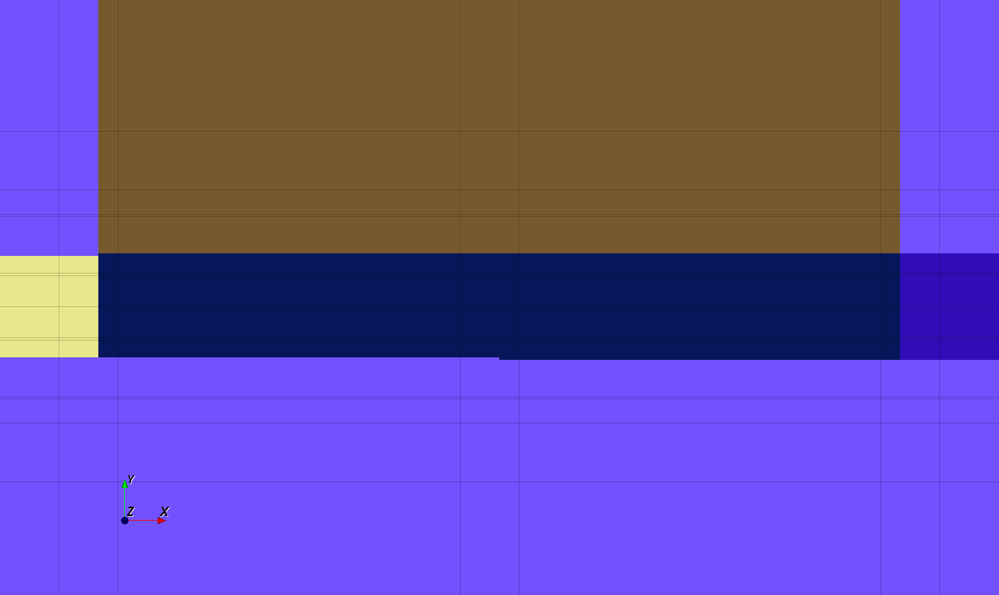
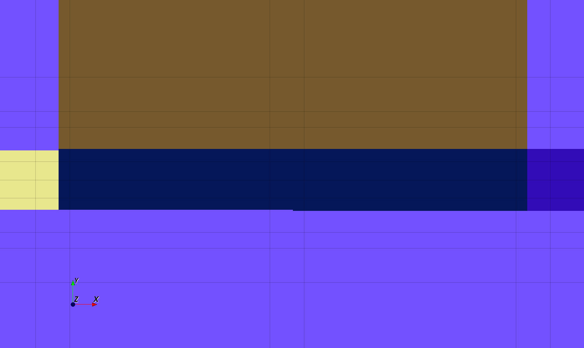

- Complicated part beacause of the `MS3` and `MS4` thin stubs. First let's remove the vertical lines of the `MS12` and `MS16` tees. Then a possibility is to reduce a little the mesh resolution to center the inner stubs vertical mesh lines. `110` instead of `100` looks good.

  ```matlab
  mesh.x = [mesh.x, ...
  %	(51.4808 + 2*metal_res/3), (51.4808 - metal_res/3), ... % MS12 : MTEE
  %	(119.902 - 2*metal_res/3), (119.902 + metal_res/3), ... % MS16 : MTEE
  	];
  ```

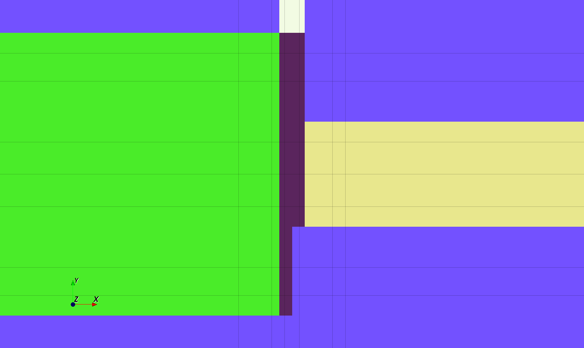
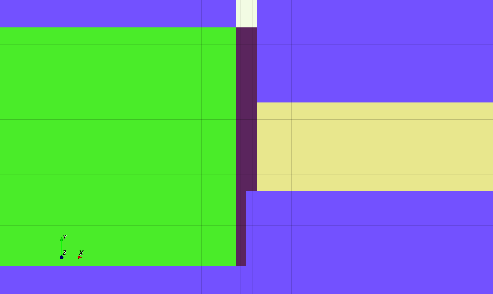


---

Now it's time to reenable smoothmesh and see the result :

```sh
octave stub.m --only-preprocess
```

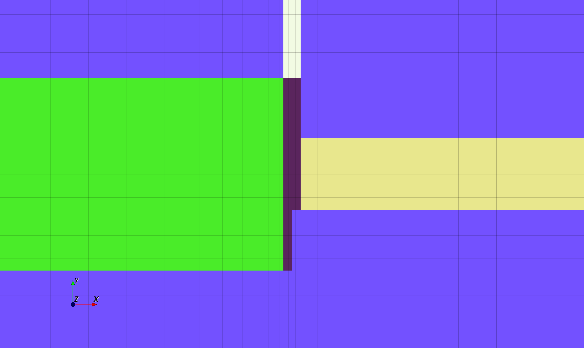
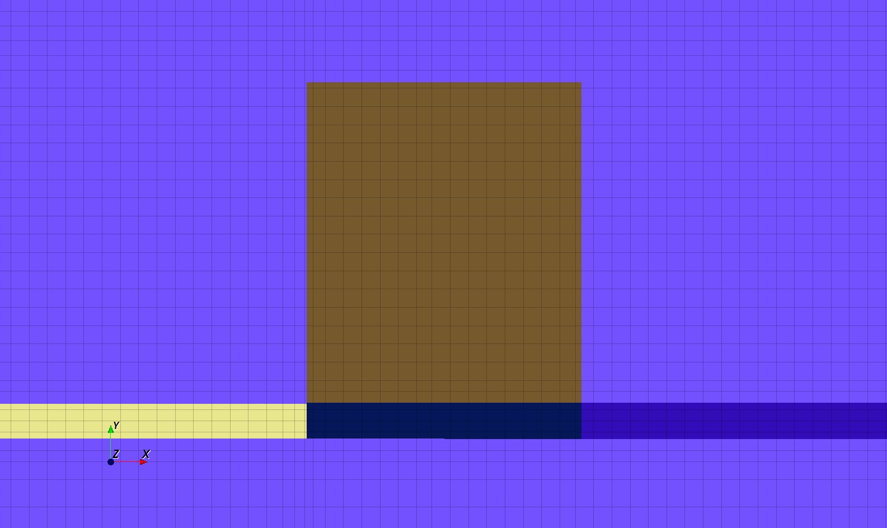
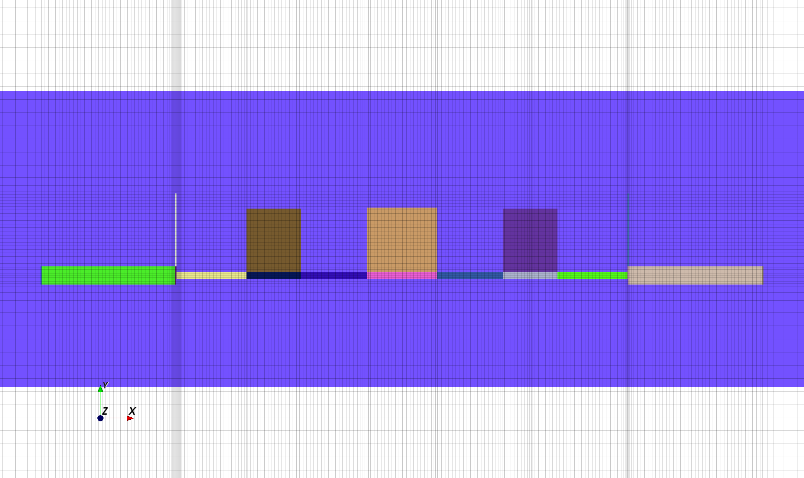

This mesh is not perfect, some edges does not respect the thirds rule and the smoothmesh is not totally symetric. But it is correct and enough to get good results. However you can try to modify the mesh resolution divisor 1 by 1 expecting a better smoothmesh but the results will be probably quite similar. For example `112` looks a little better than `110`.

---

```sh
octave stub.m
```

Here are the results comparaison Qucs / OpenEMS / Measure :


Note that the measure range is only 1GHz -> 3GHz.

### Move & resize ports : Center fed patch antenna example <a name="Move_&_resize_ports_:_Center_fed_patch_antenna_example"></a>
### Draw special geometries with Qucs components : Loop patch antenna example <a name="Draw_special_geometries_with_Qucs_components_:_Loop_patch_antenna_example"></a>
